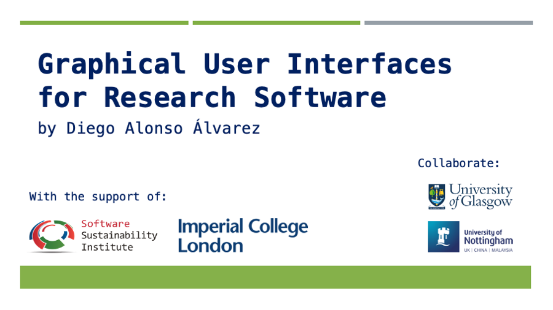

## Introduction

Research software has been a driving force behind the birth and rapid growth of informatics, but it was the appearance of graphical user interfaces (GUI) in the 1980s that made computers accessible to everyone. A GUI helps to reduce the learning curve for using software, increases the base of potential users and can ultimately increase citations and impact. Moreover, a well-designed GUI can perform validation and increase the robustness and reproducibility of the results, productively decoupling developers from users.

The goal of these workshops is to help developers lose their fear - or reluctance - to invest time creating a GUI for their research software, and help them to give those first steps in the development of graphical user interfaces. The target audience is anyone who develops research software as part of their work, in any role, academic level and department.

The creation and delivery of these workshops is possible only thanks to the [Software Sustainability institute Fellowship Programme 2020](https://www.software.ac.uk/programmes-and-events/fellowship-programme) and the strong support of the [RSE team at Imperial College London](http://www.imperial.ac.uk/admin-services/ict/self-service/research-support/rcs/research-software-engineering/).

**Main instructor**: [Diego Alonso Álvarez](INSTRUCTORS.md#diego-alonso-alvarez)

## Locations and Dates

- Online - 27th-29th April 2021 - This event is finished!
- Online - 22nd-24th June 2021 - [Registration opens May 4th (be with you...)](https://guis4rs_june21.eventbrite.co.uk)
- TBC - Q4 2021 - Registration not open yet

## Agenda

### Day 1 - 9:00-13:00
- [GUI for research software: Why are they relevant?](https://doi.org/10.5281/zenodo.4722578)
- [Introduction to interface design](https://github.com/markdturner/markdturner/raw/main/presentations/UI%20Design.pdf) (by [Mark Turner](INSTRUCTORS.md#mark-turner))
- Pitching projects for the hackday

### Day 2 - 9:00-13:00
- [GUI Architectural patterns and other peculiarities of developing GUIs](https://doi.org/10.5281/zenodo.4724518)
- [GUI toolkits for Python (and beyond)](https://doi.org/10.5281/zenodo.4724592)
- [Testing GUIs and packaging](https://doi.org/10.5281/zenodo.4724961)

### Day 3 - 9:00-17:00
- Hackday!

## Syllabus

1. GUI for research software: Why are they relevant?

**Lesson materials**: [Slides](https://doi.org/10.5281/zenodo.4722578)

Research software (RS) is designed to facilitate answering research questions, and it achieves this goal by running calculations, modeling some phenomena or managing and visualizing datasets, among many others. This is what RS is meant to accomplish, first and foremost, and everything that does not go in this direction is never a priority. GUIs in research software are nearly always considered as an aftermath - if considered at all! -, and add-on usually not very sophisticated to try to make the software more accessible. And the result is rarely fit for purpose. In this first lecture of the course we will try to answer the question of when research software might benefit from a GUI, when it will not, and what the benefits that having a well design GUI can bring to the table.

2. Introduction to interface design

**Guest lecture by**: [Mark Turner](INSTRUCTORS.md#mark-turner)
**Lesson materials**: [Slides](https://github.com/markdturner/markdturner/raw/main/presentations/UI%20Design.pdf)

As RSEs we’re always writing code, testing code and writing documentation about that code. However, every so often we have to build something that has a user interface. All of a sudden you’re not just a programmer and a database engineer but a UI/UX designer too. For those who find the world of UI/UX design a little challenging, this talk will introduce simple core concepts that form the basis of a well-designed, useful, maybe even aesthetically pleasing user interfaces. These concepts are transferable across programming languages, the web and even onto printed materials and slide decks. Hopefully by picking up a few tips of what to do, and what not to do, everyone’s user interfaces will be a little easier to use, and maybe even a little better to look at.

3. GUI Architectural patterns and other peculiarities of developing GUIs

**Lesson materials**: [Slides](https://doi.org/10.5281/zenodo.4724518)

"[An architectural pattern is a general, reusable solution to a commonly occurring problem in software architecture within a given context.](https://en.wikipedia.org/wiki/Architectural_pattern)" The context, in our case, is graphical user interfaces and the commonly occurring problem is how to keep a separation of concerns between the business logic and the visual, interacting elements, as well as how they communicate with each other. This lecture gives an overview of architectural patterns specific for GUI, going into more detail with the layered, the model-view-controller and the model-view-presenter patterns. It also discusses two techniques for developing GUIs that are often ignored or misunderstood when working with research software: event-driven programming, multithreading and multiprocessing.

4. GUI toolkits for Python (and beyond)

**Lesson materials**: [Slides](https://doi.org/10.5281/zenodo.4724592)

So far, we have been discussing general GUI theory, broadly applicable to any programming language and GUI toolkit. The fact is that the choice of language - and once this is chosen, the specific GUI toolkit to use - will have a strong impact on the implementation of the architectural patterns and the flexibility in the UI/UX design. It might even condition altogether what you can and cannot do! In this talk we explore the pretty broad landscape of GUI toolkits for Python. We first discuss some CLI to GUI converters, a handy middle ground for those who want a GUI but do not want to invest much time or effort on it, yet. A more detailed comparison is made of the dominant GUI toolkits for Python: Tkinter, PySide2, PyQT, Kivy, wxPython and Jupyter Widgets, discussing aspects like learning curve, license, maturity, etc. Demos for both the CLI to GUI converters and for some of the GUI toolkits are shown, with links in the slides. 

**Note**: Despite the examples being focussed on Python, many of these GUI toolkits are available with similar API and functionality in other programming languages. As a result, non-Python users will still benefit from the contents of this lecture.

5. Testing GUIs and packaging

**Lesson materials**: [Slides](https://doi.org/10.5281/zenodo.4724961)

The final part of the workshop address the testing of applications featuring GUIs. This has some peculiarities and important aspects to take into account to avoid getting into trouble. We will describe these known issues as well as defining what to test and how to test it. A final discussion will be made about packaging the application as a standalone executable, something not obvious to Python applications. 

6. Hackday!

The last day of the workshop will be a hackathon to put into practice all the ideas and discussions of the day before! Working in teams, the attendees will lay some concrete plans and give the first steps to develop a GUI for the software of their choice. This can be a piece of code related to a project they are already working on or something completely external to their own work. There will be pitches for the proposed projects by the end of the first day.

## Acknowledgements

I would like to thank [Frances Cooper](https://www.francescooper.net/) and [Michel Steuwer](https://michel.steuwer.info/) (University of Glasgow) and [Louise Brown](https://www.nottingham.ac.uk/engineering/people/louise.brown) (University of Nottingham) for their invaluable initial support as local organizers when the events were planed to be in-person. This would not have been possible without you.
